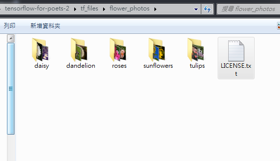
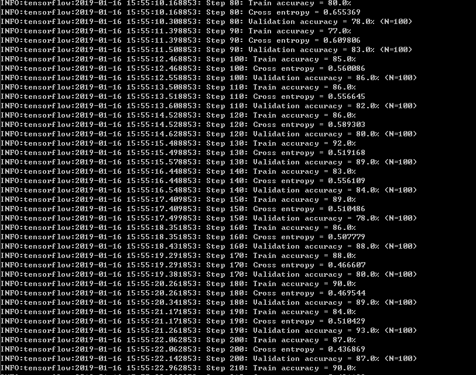
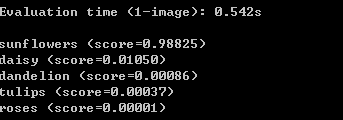
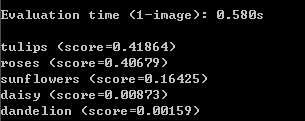

# Tensorflow_Basic
我從0到建立出基本架構的紀錄

根據範例可以成功的辨識出來五種不同的花朵

## 環境建立
雖然說網路上非常多的教學都建議不要使用windows，不過我還是在win7上做了這些基本的測試。  
網路文章說到許多的python lib會有問題，不過依照我自己測試感覺這些問題應該都被解決了。  

大概提供一下我的電腦環境
>intel 6770K  
>Z170  
>SSD 256MB  
>DDR4 16G  
>win7 64bit  


首先請先上python官網安裝git 3.6.3，也可以直接按裝以下 (絕對不要用3.7 2019/01/14當下還是很難安裝上)  
<https://www.python.org/ftp/python/3.6.3/python-3.6.3-amd64-webinstall.exe>

之後請依序安裝以下指令
```
pip install tensorflow
```
安裝CUDA的話可以使用GPU加速，不過因為我們等等訓練的不會太大所以就用CPU就好  

首先我們先把google的整包專案抓下來
```cmd
 git clone https://github.com/googlecodelabs/tensorflow-for-poets-2
```
Git的部分就不另外說明了  

然後再把官方的範例圖給抓下來
```
http://download.tensorflow.org/example_images/flower_photos.tgz
```
解壓縮之後放入 \tensorflow-for-poets-2\tf_files  
請把內部的資料夾結構建立如下

* Data folder /  
    *  Class 1 /  
         * image1  
         * image2  
    * Class 2 /  
         * image1  
         * image2  

如果要放自己的圖片的話請使用jpg or jpeg最佳，根據網路文章的講法png等等沒辦法使用  



## 訓練
根據官方的Sample Image裡面包含五種花朵 daisy, dandelion, roses, tulips, sunflowers
如果要使用自己的圖片的話也請按照這個結構放好

接下來就很輕鬆的來使用我們 "tensorflow-for-poets-2" 中scripts裡面有許多寫好的code
只是要基本訓練的話基本上不太會需要看這個部分
我們在目錄下使用下面的指令吧

```cmd
python -m scripts.retrain \ 
  --bottleneck_dir=tf_files/bottlenecks \ 
  --model_dir=tf_files/models/inception \
  --output_graph=tf_files/retrained_graph.pb \
  --output_labels=tf_files/retrained_labels.txt \
  --image_dir=tf_files/flower_photos
```
如果執行這一步驟有問題的話可能是有缺少一些python lib，譬如說 numpy之類的，看缺什麼就裝什麼。
執行後就會開始建立檔案進行訓練  


可以看到有一些精確度的部分。
等一切塵埃落定後，在tf_files裡面就會多出一些training的結果的檔案囉。
裡面有一個 "retrained_graph.pb" 就會是主要的結果。

## 測試
現在我去google上隨便抓一張向日葵的圖片下來  


輸入下面的指令
```cmd
python -m scripts.label_image --graph=tf_files/retrained_graph.pb --image=sun.jpeg
```
有些人可能會在這一步發生了編譯的問題
如果發生問題的話請再把以下參數接在後頭

```cmd
--input_layer=Mul --input_height=299 --input_width=299
```
看到結果花費了0.542秒，比對出來sunflowers有高達0.98825的得分  
  
我們已經可以成功的辨識花朵了呢

也可找多種花朵的圖片來試試看，不過因為我們的訓練模型比較基本，所以這部份就不要太期待囉  

  
這張圖經過測試 大概可以辨識出有玫瑰鬱金香跟向日葵得分超過0.1的基本上都可以視為存在。

以上就是基本入門的體驗了，如果有更多的研究會再更新上來。
